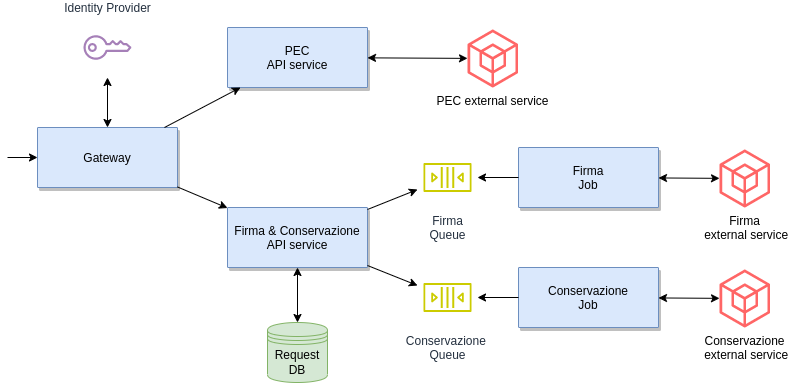
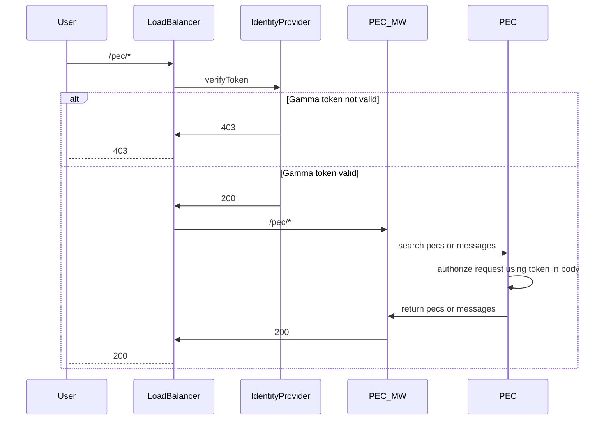
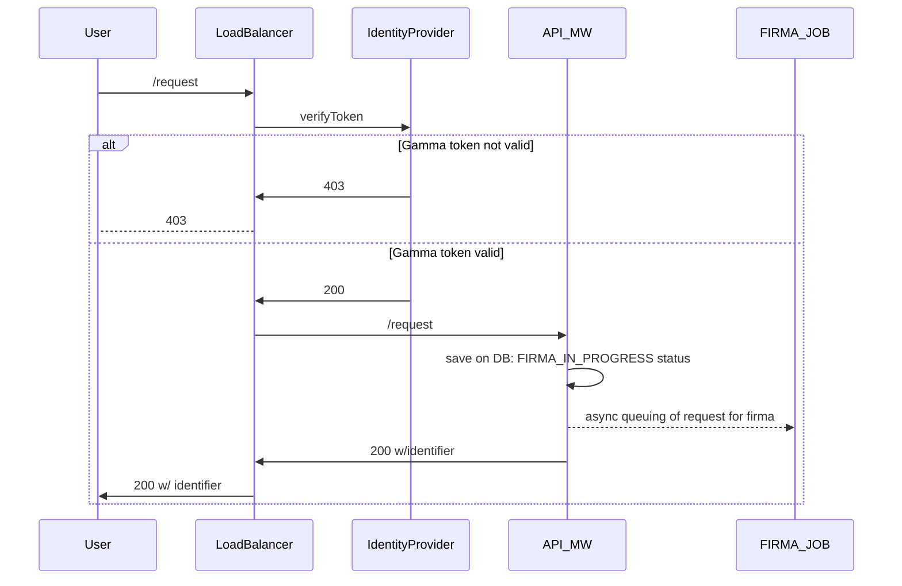
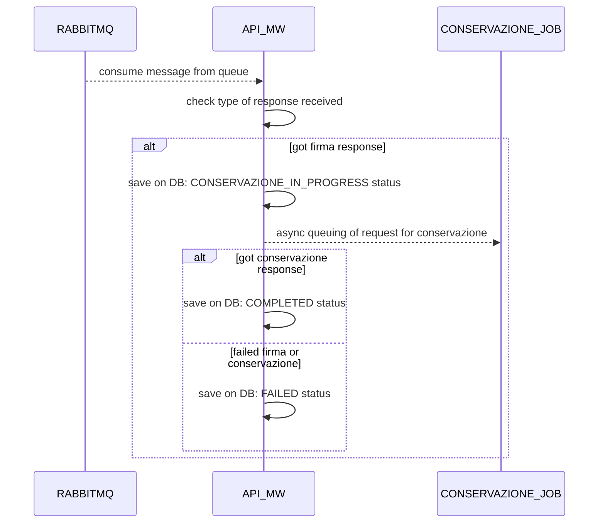
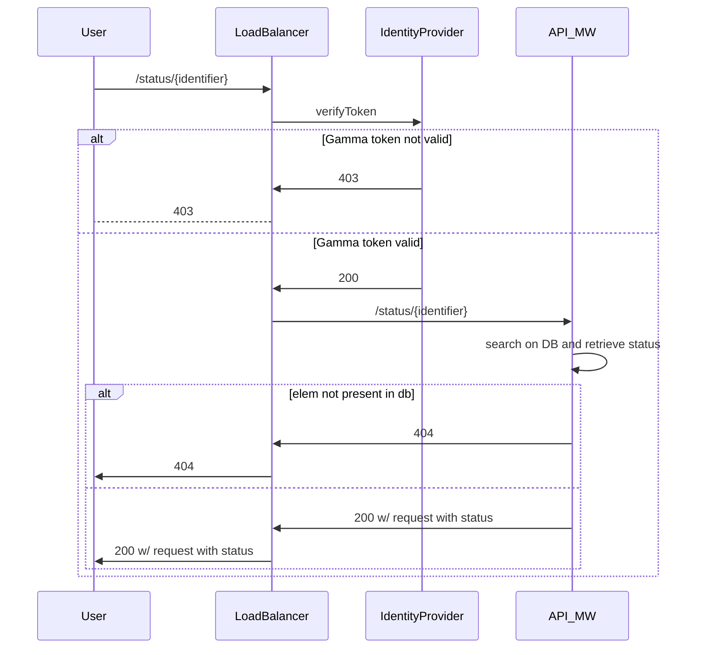

# Aruba Challenge

## Overview




The solution is composed by

* PEC API Service (pec-api module): spring boot service that exposes two endpoints:
  * /pec/list for retrieving list of pec associated to calling user
  * /pec/message for getting list of messages with filters 
  
  This APIs will require an authorization header content to be used for PEC service integration. So this authorization code 
  must be retrieved before calling API (from frontend)

* Firma & Conservazione API Service (api-async module): spring boot service that exposes two endpoints:
  * /request for submitting request of firma and conservazione of messages. It returns an identifier of the request 
    that can be used in next endpoint
  * /status/{identifier} for understanding status of the request. It will return a status among: 
    * FIRMA_IN_PROGRESS
    * CONSERVAZIONE_IN_PROGRESS
    * COMPLETED
    * FAILED
  
  This service will receive the request from issuer and submit it via a queue system. 
  
  The requests in queue will be consumed by one of the two jobs described later. First will be executed the Firma Job 
  in order to sign messages and messages will have FIRMA_IN_PROGRESS status. When firma has been done, then the other 
  job, Conservazione Job, will be in charge of conservazione phase and the status of the message will
  become CONSERVAZIONE_IN_PROGRESS. Once this has been completed, status will be updated to COMPLETED.
  
  If one of these procedures fails, status will be FAILED.

* Firma Job (module job with profile firma): spring boot service that consumes firma requests queue messages and integrates with Firma service.

  This job will require an authorization header content to be used for Firma service integration. So this authorization code
  should be set in the request message from the issuer. 

* Conservazione Job (module job with profile conserva): spring boot service that consumes conservazione requests queue messages and integrates with Conservazione service.

  This job will require an authorization header content to be used for Conservazione service integration. So this authorization code
  should be set in the request message from the issuer.

* Load balancer (not implemented yet): spring boot service that will verify token and authorize requests based on integration with
  an identity provider. 

* Message broker: in this work, RabbitMQ has been used. There are 4 defined persistent queues:
  * firma-request
  * firma-response
  * conservazione-request
  * conservazione-response
  
  In this way request of firma and conservazione are asynchronous from actual job. 
  
  Job is done and when finishes will return the OK/KO.

* Database: in this work, MariaDB has been used. This DB stores all requests issued with associated status.
  
  It is owned by Firma & Conservazione API service (single responsibility principle).

## User Journey


From frontend (not developed here but hypothetically) the user can login following OAuth2 flow. Then it should also 
connect to Firma, PEC and Conservazione services, getting the needed token for calling them.

Once all tokens have been gotten, frontend can show pec list (calling /pec/list API) and allow user to select filters.
User's token will be verified by load balancer and, if allowed, the request can proceed.

When pecs and filters have been selected, then /pec/message API will be called in order to get a list of messages.

Here is the diagram for this:



The user can select messages and associated attachments and can submit them to /request API.

This api will only queue the request and return the identifier. First the message is queued in firma-request queue.
Then, the firma job will reply on firma-response and the Firma & Conservazione service will read this and 
queue the message to conservazione-request queue. 
When the conservazione job will reply on conservazione-response then Firma & Conservazione service will
update DB with correct status.

Here is API request sequence diagram.



Event's sequence diagram:




The frontend can poll the identifier (/status/{identifier} api) in order to understand the status of the request.

Also, it can show on screen live status of the request.

Here is the polling sequence diagram:



## Prerequisites 

* java jdk 17
* docker
* docker-compose
* node 13.12.0
* npm 6.14.4


## Setup

### Overview

For all setup, commands have been collected in a Makefile.

In order to make the solution work, the following steps must be followed:
* compile
* build
* initialization
* configuration
* run

In following sections each step is described.

### Compile

Use java 17 jdk to compile both applications.

The command
```
make java_home=<path_to_jdk> compile
```
will compile and build jar file.

It uses gradle wrapper, configured inside project.
This also executes application unit tests.

### Build docker images

The command
```
make build
```
will build 3 docker images:

* `francesco/async-api`  with spring boot firma & conservazione api service
* `francesco/job`  with spring boot job service
* `francesco/pec-api`  with spring boot pec service

### Initialization

The command

```
make init
```

will run `docker-compose up` command in order to start containers from images:

* `rabbitmq`, with forwarded ports 5672 and 15672
* `mariadb`, with forwarded port 3306 and database name `messagedb`
* `castlemock`, with forwarded port 8888:8080, used for mocking PEC, Firma and Conservazione external systems

### Configuration

The command

```
make configure
```

is mandatory in order to create the two queues used by services.

Allow some time (few seconds) after `make init` before running this, because
it needs RabbitMQ to be up and running.

### Run services

The services can be run in two ways:
* launching them from terminal with `java`
* launching them as docker images

For the `java` option, you can use:
```
java -jar ./api-async/build/libs/api-async-0.0.1-SNAPSHOT.jar # async api service
java -jar ./pec-api/build/libs/pec-api-0.0.1-SNAPSHOT.jar # pec api service
SPRING_PROFILES_ACTIVE=firma java -jar ./job/build/libs/job-0.0.1-SNAPSHOT.jar # firma job-service
SPRING_PROFILES_ACTIVE=conserva java -jar ./job/build/libs/job-0.0.1-SNAPSHOT.jar # conserva job-service
```

For the `docker` option, you can use:
```
make run
```
or to run them in background:
```
make run-background
```

Pec API service will be exposed on 8080 port.

Firma & Conservazione service will be exposed on 8081 port.


### For cleaning at the end

When needed to clean all, stop docker containers of two services and also issue the command

```
make clean
```

to clean and remove containers and network created by docker-compose.


## Note on responsibility of component

* load balancer: access and OAuth2 token check
* PEC API service: integrate with PEC system 
* Async API service: manage requests for firma and conservazione and keep track of status of requests
* Firma Job: integrate with Firma system
* Conservazione Job: integrate with Conservazione system

## Note on storage

In MariaDB database, requested messages and responses status update will be stored.

A relational db has been used but can be replaced by other types of database.

## Note on ELK stack

All microservices produce logs in console and in a separate file.

The latter contains ELK compliant logs, using logback.

## Note on scaling

APIs and job are decoupled so that can be scaled independently.

The two jobs are separated for the same reason. Firma and Conservazione can be very different operations 
and also the scaling model can be different.

## What if we were in AWS world

The developed solution is an on-premise one, but adaptable to AWS (or generally cloud) scenario.

* AWS SQS instead of RabbitMQ for queue management
* AWS RDS instead of MariaDB
* AWS API Gateway: in place of load balancer service
* Spring Boot apis service: deployed and exposed as AWS Lambda through AWS API Gateway,
  with adaptation and java native compilation (for optimizing start up times)
* Spring Boot job service: deployed as ECS service, because each job can take too much time 
  to be thought as Lambdas.
* Eventual Static Frontend: deployed as hosted static website on AWS S3, with AWS Cloudfront on top if needed


## What is missing from the solution

* load balancer implementation
* eventual service discovery service (like Eureka) for optimal scaling of API services
* implementation of OAuth2 token verification (spring security OR custom filter)
* pagination of pec and messages APIs (could be a very high number so pagination is needed)
* adding of more filters on /pec/message api, now limited only by pec_id
* error management of all cases


## Author

Francesco Bonesi

<francesco.bonesi90@gmail.com>
